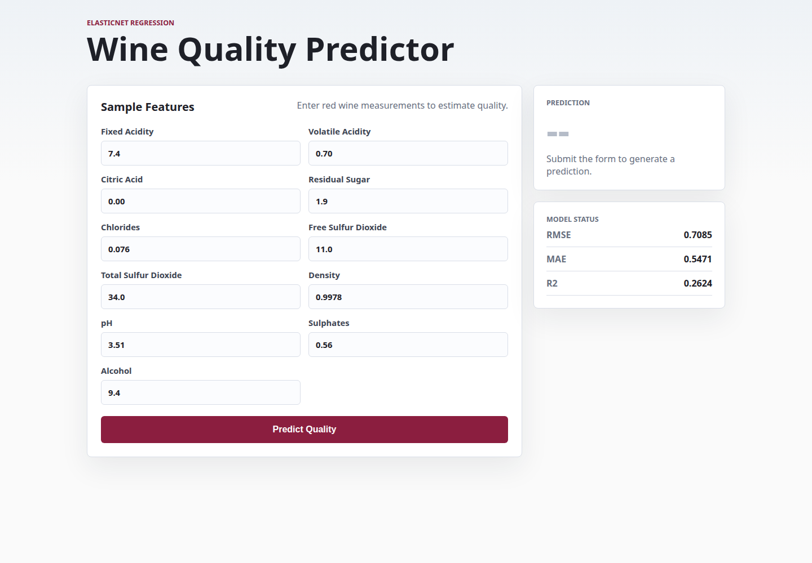
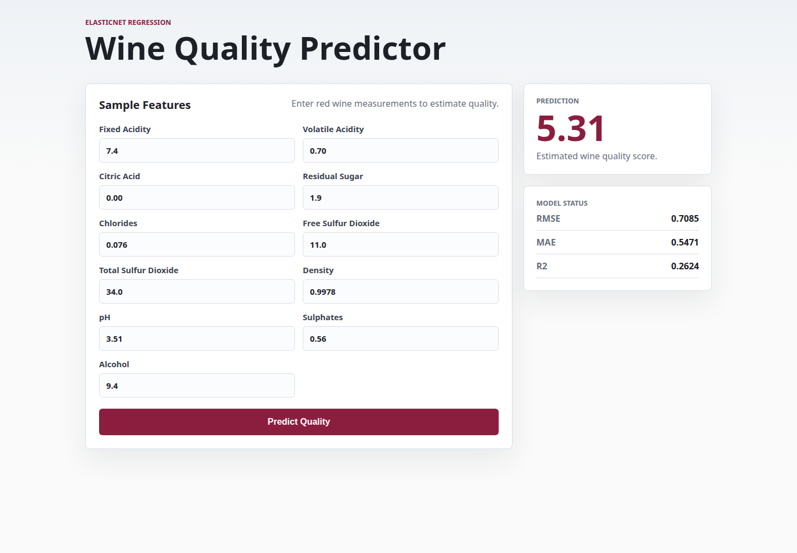
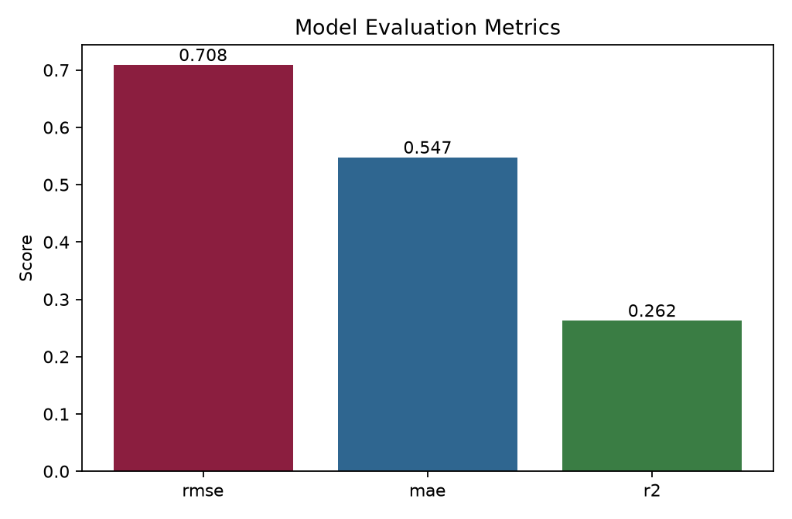
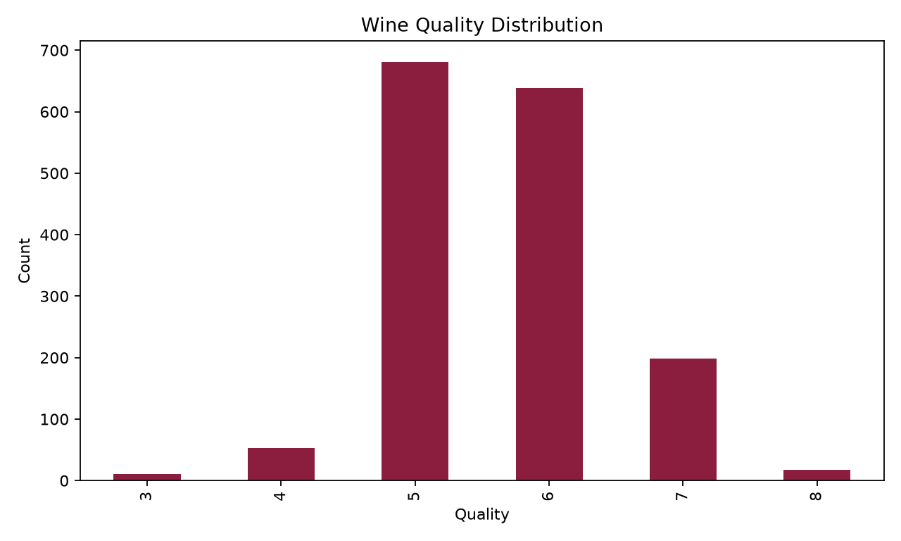
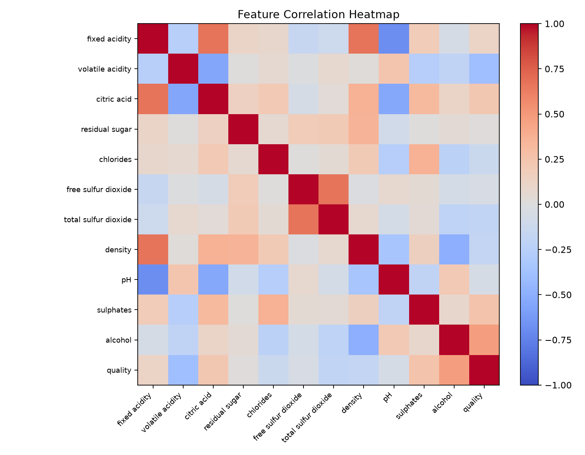
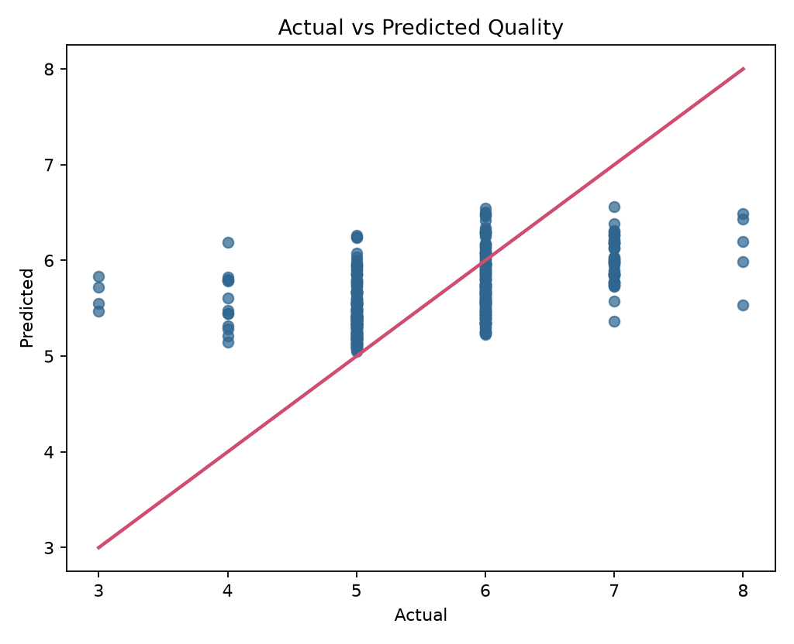
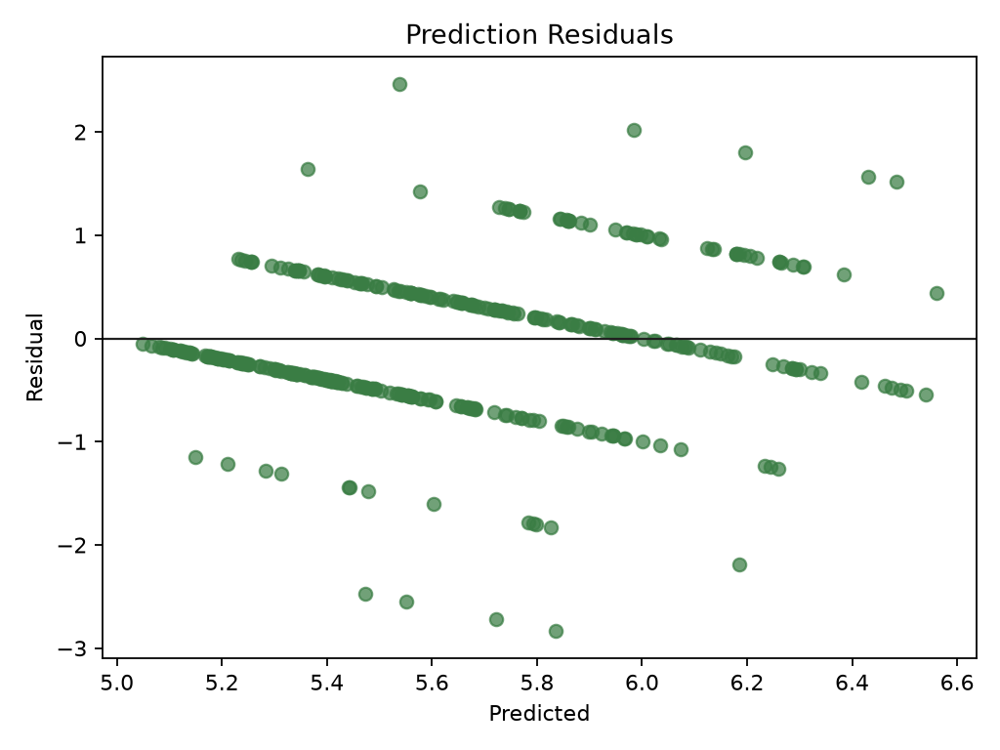

# Wine Quality ML Project

A staged machine learning project for red wine quality prediction with Flask, MLflow, and ElasticNet regression.

## Project Preview





## Setup

```bash
uv sync
```

## Train Pipeline

```bash
uv run python main.py
```

The training pipeline runs data ingestion, validation, transformation, model training, model evaluation, and report image generation.

## Run Application

```bash
uv run python app.py
```

Open the application at:

```text
http://localhost:8080
```

## Prediction Inputs

The form accepts the eleven input features from the red wine quality dataset:

```text
fixed acidity
volatile acidity
citric acid
residual sugar
chlorides
free sulfur dioxide
total sulfur dioxide
density
pH
sulphates
alcohol
```

## Pipeline Outputs

```text
artifacts/data_ingestion/data.zip
artifacts/data_ingestion/winequality-red.csv
artifacts/data_validation/status.txt
artifacts/data_transformation/train.csv
artifacts/data_transformation/test.csv
artifacts/model_trainer/model.joblib
artifacts/model_evaluation/metrics.json
```

## Model Metrics

```json
{
    "rmse": 0.7084501397716024,
    "mae": 0.5471349242354324,
    "r2": 0.26244495185679084
}
```



## Analysis Images









## Project Structure

```text
Assessment3/
├── notebooks/
├── data/
│   ├── raw/
│   └── processed/
├── artifacts/
├── config/
│   ├── config.yaml
│   ├── params.yaml
│   └── schema.yaml
├── src/
│   └── wine_quality/
│       ├── components/
│       ├── configuration/
│       ├── constants/
│       ├── entity/
│       ├── pipeline/
│       ├── utils/
│       ├── logger.py
│       └── exception.py
├── templates/
├── static/
├── docs/images/
├── app.py
├── main.py
├── pyproject.toml
├── uv.lock
└── README.md
```
